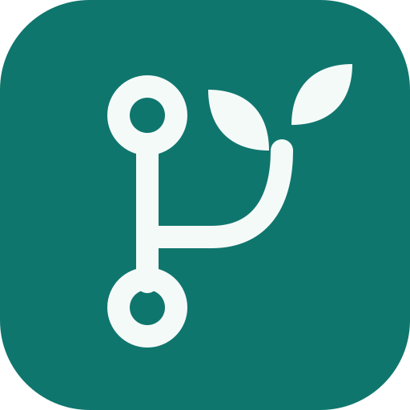

<div align="center">
  
  <h1>知枝 · Zhizhi</h1>
  <p><strong>从代码实践中长出自己的知识。</strong></p>
  <p>从真实项目与代码变化中发现值得学习的知识，理解、练习，再沉淀为自己的知识 Wiki。</p>
  <p>
    <a href="https://github.com/sep-zxy/zhizhi/actions/workflows/desktop-build.yml"></a>
    <a href="LICENSE"></a>
    
  </p>
  <p><a href="https://github.com/sep-zxy/zhizhi/releases">下载安装</a> · <a href="docs/USER_GUIDE.md">使用指南</a> · <a href="docs/BUILDING.md">构建说明</a> · <a href="https://github.com/sep-zxy/zhizhi/issues">问题反馈</a></p>
</div>

## 为什么做知枝

开发时已经遇到过很多好问题：一次 bug 修复、一段 AI 生成的代码、一次重构，或者一个解释不清的行为。改动完成之后，这些经历往往只留在提交历史里。

知枝把这些经历变成可学习、可追溯的知识。提交是来源证据，知识卡是学习入口，Wiki 是经过理解与确认后的长期积累。

适合希望从日常开发中学习的开发者，以及希望理解 AI 修改、补齐知识盲点的人。

## 目录

- [核心能力](#核心能力)
- [学习流程](#学习流程)
- [安装与快速开始](#安装与快速开始)
- [模型、数据与隐私](#模型数据与隐私)
- [项目结构](#项目结构)
- [开发与构建](#开发与构建)
- [当前边界](#当前边界)
- [参与贡献](#参与贡献)
- [上游与许可证](#上游与许可证)

## 核心能力

| 能力 | 说明 |
| --- | --- |
| 项目与提交 | 绑定本地 Git 仓库，扫描提交历史，查看知识的真实来源 |
| 今日归纳 | 从项目变化中提炼和聚合知识点候选，围绕概念组织学习 |
| 待确认 | 审阅来源与学习价值，再确认、延后或归并候选 |
| 知识卡 | 阅读讲解与代码证据，完成理解选择题、结果预测题并查看解析 |
| 上下文速问 | 围绕当前讲解、题目和来源向已配置模型追问 |
| 知识 Wiki | 学习后生成可编辑草稿，确认后新建或更新 Obsidian 笔记 |
| 主动探讨 | 从真实项目问题发起对话，将有价值的内容转成知识候选 |
| 导出与扩展 | 项目知识卡可单向导出为 Anki `.apkg`；代码中保留可选的同步云与记忆服务接口 |

主界面围绕「今日归纳、待确认、知识卡、知识 Wiki、探讨、项目与提交、设置」组织。不同日期和项目中的同一知识点可以持续补充证据。

## 学习流程

```text
项目中的代码变化 / 主动探讨
          ↓
    聚合为知识点候选
          ↓
  审阅证据并确认知识卡
          ↓
  阅读讲解 → 理解题 → 预测题
          ↓
  编辑并确认知识 Wiki 草稿
          ↓
  写入自己的 Obsidian 知识库
```

你可以随时查看原始提交和来源片段，手动重新阅读已有知识卡。Anki 导出是单向的，Anki 与知枝分别保存学习状态。

## 安装与快速开始

### 下载桌面版

从 [Releases](https://github.com/sep-zxy/zhizhi/releases) 下载与设备对应的安装包：

| 系统 | 安装包 | 说明 |
| --- | --- | --- |
| Windows x64 | `zhizhi-<版本>-win-x64.exe` | NSIS 安装包，包含桌面宿主、界面与本机 Python 服务 |
| macOS Apple Silicon | `zhizhi-<版本>-mac-arm64.dmg` | DMG，使用临时签名，尚未通过 Apple 公证 |

安装包在 GitHub Actions 构建。工作流同时生成 `SHA256SUMS.txt` 和 `build-info.json`，记录安装包校验值、源码提交与构建地址。尚未发布的构建可在 [Actions](https://github.com/sep-zxy/zhizhi/actions/workflows/desktop-build.yml) 的成功运行中下载 Artifact。

桌面版无需单独安装 Python 或 Node.js。使用 Git 项目功能需要系统中有可用的 Git：

```powershell
$ErrorActionPreference = 'Stop'
git --version
```

模型生成需要你自行配置模型提供商；下载软件不包含模型服务或 API 额度。

### 开始学习

1. 启动知枝，进入 **设置**，添加模型提供商，填写模型、接口地址与密钥，并选择生成模型。
2. 使用远程模型时，选择相应隐私模式，并检查将发送的代码和来源。
3. 在 **项目与提交** 中导入本地 Git 仓库，扫描或选择需要学习的提交。
4. 在 **今日归纳** 和 **待确认** 中审阅候选，确认值得学习的知识卡。
5. 阅读讲解与来源证据，完成理解题和结果预测题，必要时使用上下文速问。
6. 在 **知识 Wiki** 中编辑草稿；配置已有 Obsidian 库并确认后写入笔记。

完整操作、工作区备份与常见问题见 [使用指南](docs/USER_GUIDE.md)。

## 模型、数据与隐私

### 模型连接

本机分析底座支持 OpenAI、OpenAI Responses、Anthropic、Gemini、Azure、NewAPI、OpenAI 兼容接口，以及 LM Studio、Ollama 等提供商类型。具体可调用的模型和参数取决于你的服务、账号和接口协议。

远程生成和连接测试会发送真实请求，费用由相应服务计收。本地模型同样需要你提前部署并启动。

### 本地数据

桌面版将工作区保存在系统应用数据目录中的 `growth-companion-desktop/workspace`。Windows 通常对应：

```text
%APPDATA%\growth-companion-desktop\workspace
```

其中 `.ahadiff/` 保存工作区配置与记录。技术目录名保留旧值，升级品牌名称不会自动搬迁数据。可通过 `GROWTH_WORKSPACE` 指定其他工作区；备份和恢复前先退出应用。

Obsidian 笔记写入你明确选择的库与目标目录。请同时备份工作区和知识库；密钥与私人数据应单独保护。

### 隐私模式

| 模式 | 用途 |
| --- | --- |
| `strict_local` | 默认模式，用于本地提供商与本地处理 |
| `redacted_remote` | 使用脱敏后的内容调用远程提供商 |
| `explicit_remote` | 在明确授权范围内使用远程提供商 |

本地优先指工作区默认在本机保存；接入远程模型或开启云同步后，相应内容会离开本机。发送前仍需审阅，自动脱敏无法保证覆盖所有敏感信息。

可选同步云、ReMe 和 CodeGraph 需要独立部署或安装。它们不是首次使用桌面版的必需组件，也不随桌面安装包提供可直接使用的公共服务。

## 项目结构

```text
zhizhi/
├── .github/workflows/       # GitHub Actions 桌面构建
├── desktop/                # Electron 宿主、打包配置、Python sidecar 入口
│   └── build/              # Windows ICO 与 macOS ICNS 图标源资源
├── viewer/                 # React + TypeScript + Vite 界面
│   ├── public/             # 应用图标、PWA 清单与资源许可
│   ├── src/                # 页面、组件、API 客户端与样式
│   └── tests/              # 前端测试源码
├── src/ahadiff/             # Python 分析底座、本地 API 与 CLI
│   └── growth/             # 知识卡、学习、Wiki、同步与可选云服务
├── tests/                  # 后端单元与集成测试源码
├── benchmarks/             # 可重复使用的基准脚本与输入样本
├── scripts/                # 构建限制与仓库维护脚本
├── docs/                   # 使用、构建与品牌说明
├── AGENTS.md               # 项目协作约束
├── CONTRIBUTING.md         # 贡献指南
├── SECURITY.md             # 安全问题报告方式
├── pyproject.toml          # Python 项目配置
├── uv.lock                 # Python 依赖锁
└── LICENSE                 # MIT 许可证及上游版权声明
```

开发截图、设计提示词、历史验收产物、旧宣传页和旧工作流已从公开目录移出。运行数据、凭证、依赖目录与构建产物不会进入源码仓库。

## 开发与构建

技术栈为 React / TypeScript / Vite、Electron、Python 与 SQLite；可选同步云使用 PostgreSQL。

**所有构建必须在 GitHub 托管的 Actions runner 上执行。** 本地只进行必要的语法、类型和配置校验；前端构建、PyInstaller 打包、Python 发行包构建和 Electron 打包均不在本地运行。

触发构建并下载结果：

```powershell
$ErrorActionPreference = 'Stop'
gh workflow run 'desktop-build.yml' --repo 'sep-zxy/zhizhi' --ref 'main'
gh run list --repo 'sep-zxy/zhizhi' --workflow 'desktop-build.yml' --limit 5
# 将 <RUN_ID> 替换为成功运行的编号
gh run download '<RUN_ID>' --repo 'sep-zxy/zhizhi' --dir './dist/downloads'
```

实际使用 PowerShell 命令时应替换尖括号中的占位值。更多构建条件、产物验证和发布步骤见 [构建说明](docs/BUILDING.md)。

### 名称兼容

产品名是 **知枝**，仓库名是 `zhizhi`。Python 包、CLI 与部分配置仍使用 `ahadiff`，桌面技术名仍使用 `growth-*`。这些名称用于兼容现有入口和数据，不代表安装上游 PyPI 包即可获得知枝桌面版。

## 当前边界

- AI 讲解与题目可能有错误。来源引用可以帮助核对原文，不能替代实际代码验证。
- 当前主要界面面向中文用户，部分底座设置保留国际化能力。
- Windows 包通过 CI 检查后端与桌面页面启动；macOS 包检查后端、资源和临时签名。这些检查不等于完整的真实用户情境验收。
- 跨设备同步、记忆服务和代码索引依赖外部环境；尚未在公开部署条件下完成端到端验收。
- 自动更新、Windows 证书签名与 macOS 公证暂未配置。升级时下载新包，并保留原工作区备份。

## 参与贡献

欢迎提交问题、文档改进和代码修复。开始前请阅读 [贡献指南](CONTRIBUTING.md) 和 [项目协作约束](AGENTS.md)。

报告问题时请附上操作系统、知枝版本、复现步骤和脱敏日志。不要在公开 Issue 中粘贴 API 密钥、完整私人代码或工作区数据库。安全问题按 [安全政策](SECURITY.md) 处理。

## 上游与许可证

知枝基于 [AhaDiff](https://github.com/AGI-is-going-to-arrive/ahadiff) 的本地代码分析、证据与模型连接能力继续开发，并增加围绕开发者成长的知识工作流与桌面界面。

项目使用 [MIT License](LICENSE)，保留 AhaDiff Contributors 的版权与许可证声明。字体与第三方资源的许可证随对应资源保存，见 `viewer/public/licenses/`、`viewer/src/assets/fonts/` 和相关依赖。
